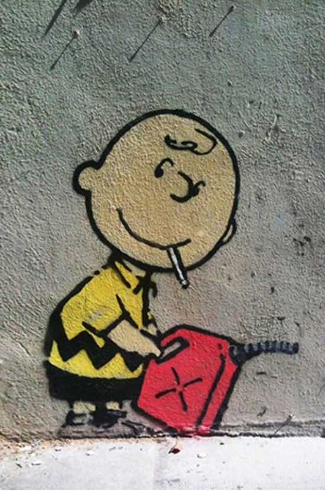

# ArtFlow

#### Somos una pagina para amantes del arte.

### Por: Ainoha Maria Jiménez Zamora

## Arte moderno

### El arte moderno se desarrolló aproximadamente desde finales del siglo XIX hasta la década de 1960, y se caracterizó por un enfoque en la experimentación y la innovación en términos de forma, color y materiales. Algunos de los movimientos más destacados dentro del arte moderno incluyen el impresionismo, el fauvismo, el cubismo, el surrealismo, el expresionismo y el abstraccionismo.

## Arte contemporaneo

### El arte contemporáneo se refiere a la producción artística desde la década de 1960 hasta la actualidad. El arte contemporáneo se caracteriza por una mayor diversidad de enfoques y estilos, y a menudo se asocia con una crítica social y política más explícita. Algunos de los movimientos más importantes dentro del arte contemporáneo incluyen el arte conceptual, el arte minimalista, el arte pop, el arte de instalación, el performance y el arte digital.

## Artistas

### Banksy

#### Sus obras de arte se caracterizan por su crítica social, política y cultural, y a menudo presentan un estilo irónico y humorístico. A pesar de que la identidad de Banksy sigue siendo desconocida, se cree que es originario de Bristol, Inglaterra, y que nació en la década de 1970. Su trabajo ha sido objeto de numerosas exposiciones y ha sido vendido por millones de dólares en subastas de arte.

-   Artista anonimo de arte urbano britanico

-   Fusionó el arte del graffiti con la instalación y el rendimiento

**Historia de Banksy**

[Historia](https://www.gallerybarcelona.com/banksy/)

### Jackson Pollock

#### Era un pintor estadounidense. Es considerado uno de los más importantes representantes del movimiento artístico conocido como el expresionismo abstracto. Su obra se caracteriza por la abstracción, la espontaneidad y la exploración de la psicología del inconsciente. Pollock fue uno de los artistas más influyentes de la segunda mitad del siglo XX, y su legado sigue siendo muy valorado por la crítica y el público.

-   Destacado por sus lienzos con colores vivos.

-   Utilizaba tecnicas como el *dripping* y *action painting*.

**Historia de Jackson Pollock**

[Historia](https://www.biografiasyvidas.com/biografia/p/pollock.htm)

### Pablo Picasso

#### Picasso experimentó con una amplia variedad de estilos y técnicas, incluyendo el cubismo, el surrealismo y el expresionismo. Sus obras incluyen pinturas, esculturas, dibujos y grabados, y se caracterizan por su uso innovador del color, la forma y la composición.Picasso también influyó en otros artistas y movimientos de arte y su legado continúa siendo estudiado y celebrado en todo el mundo.

-   Pintor y escultor español
-   Pionero del cubismo

**Historia de Pablo Picasso**

[Historia](https://www.biografiasyvidas.com/biografia/p/picasso.html)

### Marina Abramović

#### Es considerada una de las figuras más influyentes en el arte contemporáneo.Su trabajo a menudo implica la exploración de límites físicos y psicológicos, así como la interacción con el público.

-   Artista visual y performática serbia
-   Pionera del arte performance contemporaneo

**Historia de Marina Abramović**

[Historia](https://graffica.info/marina-abramovic-la-madrina-del-arte-de-la-performance/)

